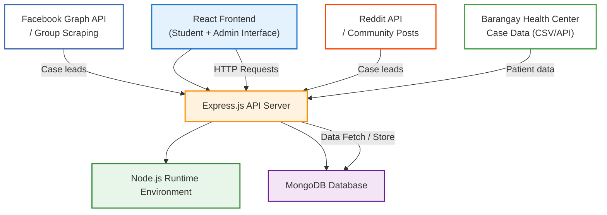

# SmileConnect

SmileConnect is a platform that helps dental students connect with patients who need affordable care. This makes it easier for students to gain clinical experience and for patients to access treatment. 

## Overview

Dentists play a vital role in the Philippine healthcare system, with dental visits accounting for a significant share of outpatient consultations annually. Doctor of Dental Medicine programs in universities such as UP, CEU, UE, MCU, and OLFU require students to perform real clinical operations—ranging from extractions to prosthodontics—often offered as free treatment under faculty supervision.

Despite the presence of dental services, educational initiatives, established national health system efforts, and various oral health interventions and procedures, oral health issues—such as dental caries, gum diseases, and unmet dental needs—continue to be prevalent in the Philippines (Alas et al., 2023).

## The App

This is a simple web app built with the MERN stack (MongoDB, Express, React, Node.js)—a popular set of tools for building modern websites—to help student dentists find patients. 
The platform connects dental schools with local health centers, underserved urban areas, and online communities, making it easier to match students needing clinical cases with people who need free dental care. This improves access to dental procedures while making better use of available clinics and staff.

## Deployment

### Online

You can try SmileConnect instantly online:
[https://smileconnect.netlify.app/](https://smileconnect.netlify.app/)

### Local Development (MERN Stack)

1. **Clone the repository:**
   ```bash
   git clone <repo-url>
   cd smileconnect
   ```
2. **Install dependencies:**
   ```bash
   pnpm install
   # or
   npm install
   ```
3. **Set up environment variables:**
   - Copy `.env.example` to `.env` and fill in your MongoDB URI and any other required variables.
4. **Start the development servers:**
   - For the frontend (Next.js):
     ```bash
     pnpm run dev
     # or
     npm run dev
     ```
   - For the backend (Express.js):
     ```bash
     # If backend is in a separate folder, navigate there and run:
     pnpm run server
     # or
     npm run server
     ```
5. **Access the app:**
   - Frontend: [http://localhost:3000](http://localhost:3000)
   - Backend API: [http://localhost:5000](http://localhost:5000) (default)

---

## Tech Stack


---

## Architecture



---

## Developers

Simonee Ezekiel Mariquit  
*Project Manager*  

Christine May Ponciano  
*Frontend Developer*  

**JZ**  
Junjun Zaragosa  
*Backend Developer*  

**SD**  
Samuelson De Vera  
*UX Designer*  

**KM**  
Kharl Andre Miguel  
*Data Specialist*  

---

